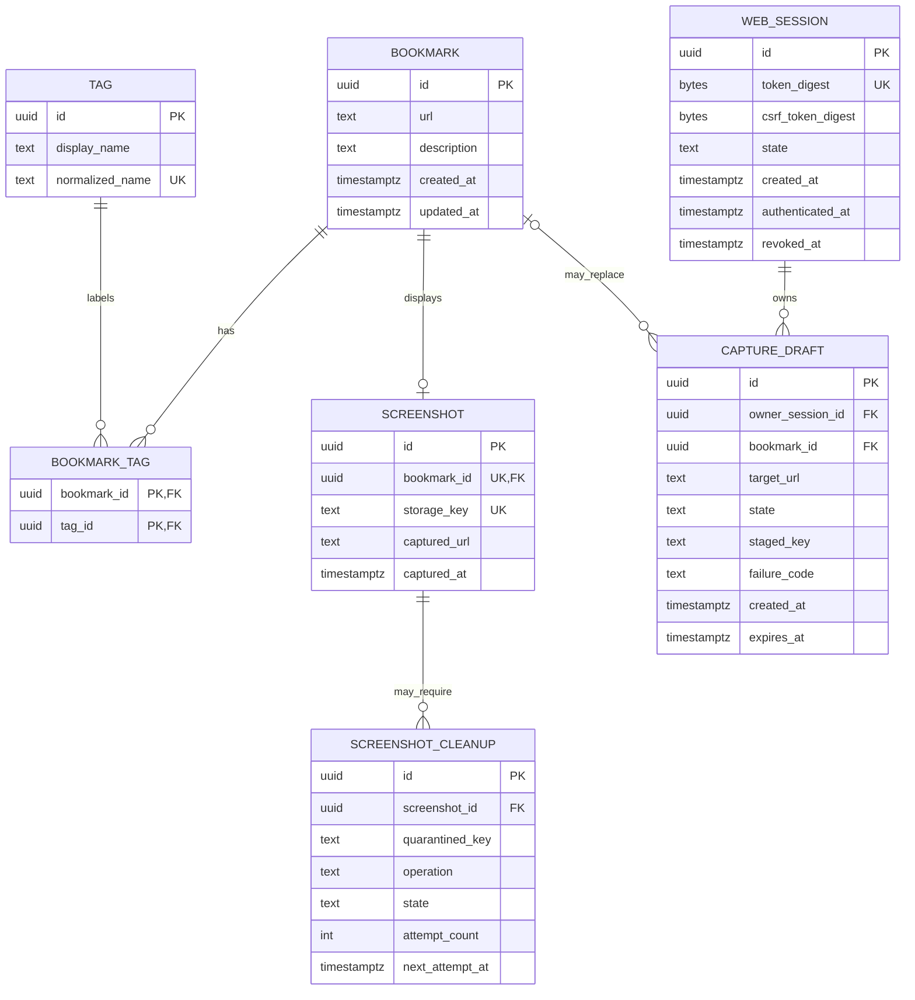
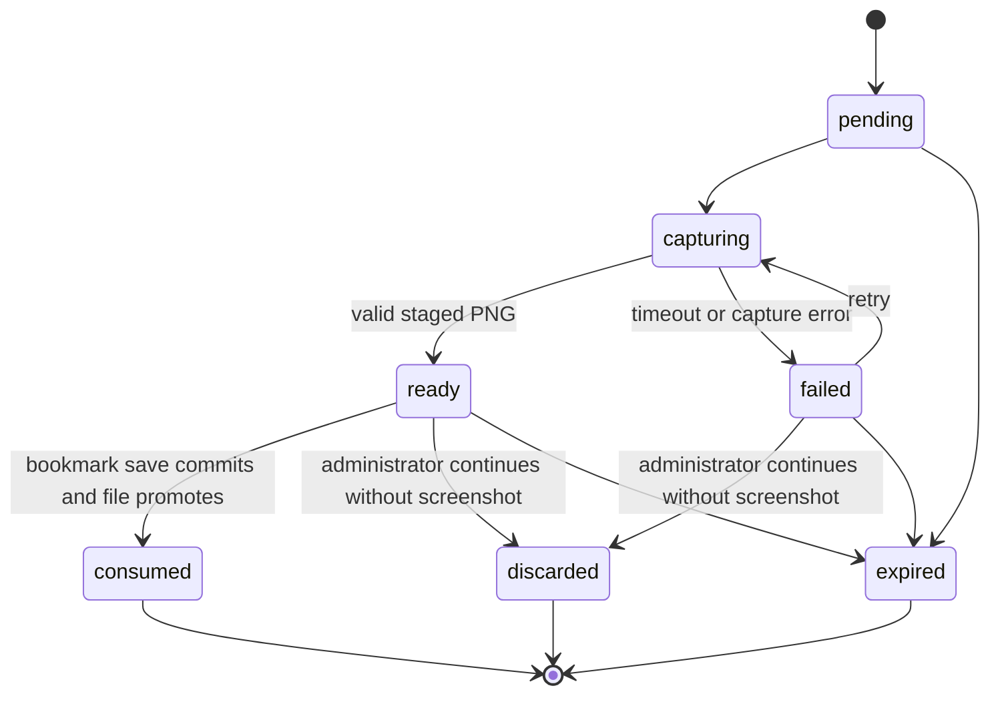

# Bookmarker Administration Data Model

**Feature**: `001-bookmark-administration`  
**Date**: 2026-08-31  
**Research basis**: [research.md](research.md)

## Modeling Conventions

- Persistent identifiers are opaque UUIDs generated before adapter calls.
- Timestamps are UTC instants. The HTTP adapter formats dates for the deployment locale and time zone.
- Domain models contain no pgx, YAML, HTTP, template, or process types.
- Bookmark URLs are deliberately **not unique**. URL equality has no persistence meaning.
- User-visible validation errors identify fields and stable error codes without echoing secrets.

## Entity Relationships

## Bookmark

The saved web reference returned by browse and search use cases.

| Field | Type | Required | Rules |
| --- | --- | --- | --- |
| `id` | UUID | Yes | Immutable and opaque. |
| `url` | string | Yes | Absolute `http` or `https` URL; parsed structurally; no embedded credentials; retained independently of other bookmarks with the same URL. |
| `description` | string | Yes | Trimmed, non-empty plain text with an implementation-defined documented maximum length. |
| `created_at` | instant | Yes | Assigned once and never changed by edit. |
| `updated_at` | instant | Yes | Equals creation time initially and advances only after a successful edit. |
| `tags` | ordered set of Tag | No | De-duplicated by normalized name; presented in deterministic normalized-name order. |
| `screenshot` | Screenshot reference | No | At most one active screenshot. Missing or unreadable files do not invalidate the bookmark. |

**Persistence rules**:

- Primary key: `id`.
- Index: `(created_at DESC, id DESC)` for stable newest-first pagination.
- Generated or maintained `simple` text-search vector over `description`, indexed with GIN.
- No unique constraint or deduplication check on `url`.
- A bookmark and its bookmark/tag rows are inserted or edited in one PostgreSQL transaction.
- Deleting a bookmark cascades bookmark/tag rows and its screenshot metadata after filesystem quarantine succeeds.

## Tag

The canonical label shared by bookmarks.

| Field | Type | Required | Rules |
| --- | --- | --- | --- |
| `id` | UUID | Yes | Immutable and opaque. |
| `display_name` | string | Yes | Trimmed canonical display form retained from the first accepted spelling. |
| `normalized_name` | string | Yes | Trimmed, Unicode-normalized and case-folded comparison form; non-empty. |

**Persistence rules**:

- Unique constraint on `normalized_name`.
- `bookmark_tags` has composite primary key `(bookmark_id, tag_id)` and cascading foreign keys.
- Concurrent tag creation uses insert-on-conflict followed by selection of the canonical row.
- Exact filtering and tag search compare `normalized_name`, never display spelling.
- Orphaned tags may be removed in the bookmark write transaction; they are not part of the public contract.

## Screenshot

Metadata for a promoted screenshot file associated one-to-one with a bookmark.

| Field | Type | Required | Rules |
| --- | --- | --- | --- |
| `id` | UUID | Yes | Immutable and opaque. |
| `bookmark_id` | UUID | Yes | Unique foreign key to Bookmark. |
| `storage_key` | string | Yes | Unique application-generated relative key under the configured root; never accepts an absolute path or `..`. |
| `captured_url` | string | Yes | Final HTTP/HTTPS destination reported by capture after redirects. |
| `captured_at` | instant | Yes | Successful capture time. |
| `media_type` | string | Yes | Fixed to the supported screenshot format, initially `image/png`. |
| `byte_size` | integer | Yes | Positive and bounded by configured operational limits. |

The public view resolves this metadata through the screenshot port. If the file is missing or unreadable, it returns a placeholder and records a safe structured error; bookmark retrieval still succeeds.

## Capture Draft

A session-owned staged screenshot attempt that exists before bookmark creation or replacement is committed.

| Field | Type | Required | Rules |
| --- | --- | --- | --- |
| `id` | UUID | Yes | Used as the form's opaque capture token. |
| `owner_session_id` | UUID | Yes | Must match the authenticated session using the draft. |
| `bookmark_id` | UUID | No | Present only for replacement of an existing bookmark screenshot. |
| `target_url` | string | Yes | Parsed HTTP/HTTPS URL captured by this exact attempt. |
| `state` | enum | Yes | `pending`, `capturing`, `ready`, `failed`, `consumed`, `discarded`, or `expired`. |
| `staged_key` | string | No | Relative staging key present only after a capture produced a validated file. |
| `final_url` | string | No | Final HTTP/HTTPS destination after redirects. |
| `failure_code` | string | No | Stable safe code such as `timeout`, `unreachable`, `invalid_output`, or `capture_failed`. |
| `failure_message` | string | No | User-safe explanation with secrets and sensitive URL detail removed. |
| `created_at` | instant | Yes | Attempt creation time. |
| `expires_at` | instant | Yes | Bounded cleanup deadline; expired drafts cannot be consumed. |

**State transitions**:

A draft is consumed only when its owner, target URL, and optional bookmark ID match the save request. Changing the form URL invalidates the prior draft. Saving without a screenshot requires an explicit form value after a failed or discarded capture.

## Screenshot Cleanup

Repair metadata for a filesystem action that could not finish after the authoritative database transition.

| Field | Type | Required | Rules |
| --- | --- | --- | --- |
| `id` | UUID | Yes | Immutable repair identifier. |
| `screenshot_id` | UUID | No | Retained identifier; may no longer have an active screenshot row after delete. |
| `quarantined_key` | string | Yes | Validated relative key under the screenshot root. |
| `operation` | enum | Yes | `promote`, `remove_replaced`, or `remove_deleted`. |
| `state` | enum | Yes | `pending`, `running`, `succeeded`, or `abandoned`. |
| `attempt_count` | integer | Yes | Starts at zero and increments per bounded retry. |
| `next_attempt_at` | instant | Yes | Backoff-controlled retry time. |
| `last_error_code` | string | No | Safe operational category only. |

Cleanup entries are not user-facing bookmark state. Exhausted retries remain observable for operator repair and never recreate a deleted bookmark.

## Web Session

Server-side browser-session-scoped state used by both anonymous login forms and authenticated administration.

| Field | Type | Required | Rules |
| --- | --- | --- | --- |
| `id` | UUID | Yes | Internal identifier. |
| `token_digest` | bytes | Yes | Unique digest of a random cookie token; the token itself is never persisted. |
| `csrf_token_digest` | bytes | Yes | Digest of the synchronizer token; rotated on authentication. |
| `state` | enum | Yes | `anonymous`, `authenticated`, or `revoked`. |
| `created_at` | instant | Yes | Server creation time. |
| `authenticated_at` | instant | No | Set on successful sign-in. |
| `revoked_at` | instant | No | Set on sign-out or invalidation. |

The cookie has `Secure`, `HttpOnly`, and `SameSite=Lax` attributes and no persistent expiry attributes. Closing the browser discards the only usable token. Sign-in rotates the token and CSRF value to prevent fixation; sign-out marks the row revoked before clearing the cookie. Operational retention may remove inaccessible stale rows without changing session semantics.

## Login Throttle Pair

Transactional aggregate enforcing failures for one normalized username and trusted source-address pair.

| Field | Type | Required | Rules |
| --- | --- | --- | --- |
| `username_key` | bytes | Yes | Non-reversible keyed digest of the normalized attempted username; not the displayed username. |
| `source_address` | IP address | Yes | Derived from the peer unless the peer is an explicitly trusted proxy. |
| `window_started_at` | instant | Yes | Start of the current 10-minute failure window. |
| `failure_count` | integer | Yes | Non-negative; reset after the window expires or authentication succeeds. |
| `blocked_until` | instant | No | Set to 15 minutes after the fifth in-window failure. |
| `updated_at` | instant | Yes | Supports cleanup of inactive pairs. |

Primary key is `(username_key, source_address)`. Failure evaluation and increment occur under one PostgreSQL row lock or equivalent atomic statement. A pair with `blocked_until > now` is rejected without password verification and receives a generic authentication response. A successful sign-in clears only that pair. Other addresses and usernames are unaffected.

## Application Configuration

This typed aggregate is persisted atomically as one strict YAML document rather than in PostgreSQL.

| Group | Fields | Validation and exposure |
| --- | --- | --- |
| `administrator` | `username`, `password_hash` | Required deployment-managed values. Hash must be a supported Argon2id PHC verifier. Entire group is excluded from web read/update DTOs. |
| `branding` | `page_title`, `favicon_path` | Title has a documented non-empty length bound. Favicon must resolve under an allowed asset root and pass supported media/content validation. |
| `default_view` | enum | `list`, `add`, `search`, or `configuration`; protected defaults redirect through sign-in. |
| `screenshots` | `root` | Absolute or deployment-root-relative writable directory; staged and final files must remain beneath it. |
| `database` | host, port, name, user, password environment reference, TLS mode | Structure is editable after redaction; secret values are environment-resolved, never displayed or written into YAML. Connectivity validation occurs before activation; restart may be required. |
| `search` | `page_size`, `maximum_results` | Positive bounded integers with `page_size <= maximum_results`; maximum supports at least the specified 10,000-result acceptance scale. |
| `server` | listen address, trusted proxy CIDRs | Deployment-managed; trusted proxies must parse as explicit CIDRs. |

Unknown YAML fields, duplicate mapping keys, unsupported enum values, inline database passwords, malformed environment references, invalid paths, and inconsistent search limits reject the candidate as a whole. Activation writes a same-directory temporary file, syncs and atomically renames it, and preserves the previous in-memory and on-disk configuration on any failure.

## Query Models

### Browse Query

- Inputs: optional normalized tag and requested page.
- Fixed page size: 10.
- Ordering: `created_at DESC, id DESC`.
- Page normalization: values below 1 become 1; values above the final page become the final available page; an empty collection uses page 1 with no pagination controls.

### Search Query

- Inputs: optional tag, optional description words, requested page, configured page size, and configured maximum results.
- At least one non-empty criterion is required.
- Description input is parsed with PostgreSQL `plainto_tsquery('simple', input)` and must match all resulting lexemes.
- When both criteria are present, the exact normalized tag predicate and description predicate are combined with AND.
- Matching rows are ordered newest first, bounded to the configured maximum, and only then paginated.
- Result metadata includes `total_within_cap`, `is_capped`, `page`, `page_size`, and `last_page`.

## Aggregate Invariants

1. A bookmark save never exposes a screenshot reference until its database metadata is committed and the staged file can be promoted or compensated.
2. A URL change cannot consume a capture draft created for another URL.
3. A bookmark update never changes `created_at`.
4. One bookmark cannot contain the same normalized tag twice.
5. Duplicate bookmark URLs remain valid separate records.
6. A capture draft can be consumed once and only by its owning authenticated session.
7. Protected configuration DTOs never contain administrator credentials or resolved secret values.
8. Revoked sessions and blocked login pairs cannot authorize a write operation.
