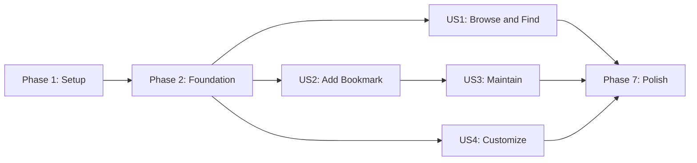

# Tasks: Bookmarker Administration

**Input**: Design documents from `/specs/001-bookmark-administration/`

**Prerequisites**: `plan.md`, `spec.md`, `research.md`, `data-model.md`, `contracts/`, `quickstart.md`

**Tests**: Required. The constitution mandates reviewed failing tests before implementation and real-boundary integration tests for contracts and schema changes.

**Organization**: Tasks are grouped by user story so each story can be implemented and validated as a usable increment.

## Format: `[ID] [P?] [Story] Description`

- **[P]**: Can run in parallel because it targets different files and has no dependency on another incomplete task in the phase.
- **[Story]**: Maps the task to a user story from `spec.md`.
- Every task names the exact file or files it changes.

## Phase 1: Setup (Shared Infrastructure)

**Purpose**: Initialize the Go module, browser-test toolchain, vendored browser asset, and repeatable developer commands.

- [X] T001 Initialize the `la-memoria` Go 1.27 module and declare the library version in `go.mod`
- [X] T002 Add pgx v5, YAML v3, Argon2id support, UUID generation, and Testcontainers dependencies with pinned module checksums in `go.mod` and `go.sum`
- [X] T003 [P] Define npm scripts and pin Playwright test dependencies in `package.json` and `package-lock.json`
- [X] T004 [P] Configure Chromium, Firefox, and mobile Chromium Playwright projects in `playwright.config.ts` and `tsconfig.json`
- [X] T005 [P] Vendor minified htmx 2.0.10 and its license in `web/static/vendor/htmx.min.js` and `web/static/vendor/HTMX-LICENSE.txt`
- [X] T006 [P] Ignore the runtime root `config.yaml`, local configuration overrides, screenshot staging, Go, Playwright, and test artifact outputs while retaining redacted examples and test fixtures in `.gitignore`
- [X] T007 Add reproducible format, unit, contract, integration, E2E, and full-validation targets in `Makefile`

---

## Phase 2: Foundational (Blocking Prerequisites)

**Purpose**: Establish shared domain boundaries, configuration bootstrap, schema, authentication, secure delivery scaffolding, logging, and real-boundary test fixtures.

**Critical**: No user-story implementation begins until the foundational tests have been reviewed failing, then pass with this phase's implementation.

### Foundational Tests and Test Infrastructure

- [X] T008 Create a PostgreSQL 18.6 Testcontainers lifecycle and migration helper in `tests/testkit/postgres.go`
- [X] T009 [P] Create deterministic clock, ID generator, password, capture-process, and port fakes in `tests/testkit/fakes.go`
- [X] T010 [P] Write failing real-PostgreSQL migration tests for schema version `0001`, constraints, indexes, and rollback in `tests/integration/migrations_test.go`
- [X] T011 [P] Write failing strict YAML startup tests for unknown fields, duplicate keys, Argon2id PHC syntax, environment references, secret rejection, defaults, missing files, and rejection of runtime configuration files with group or other permission bits in `tests/contract/config_load_test.go`
- [X] T012 [P] Write failing authentication unit tests for constant-time verifier outcomes, session rotation/revocation, browser-session lifetime, and generic failures in `bookmarker/usecase/auth_test.go`
- [X] T013 [P] Write failing real-PostgreSQL tests for concurrent pair-specific login throttling and session revocation in `tests/integration/postgres_auth_test.go`
- [X] T014 [P] Write failing HTTP security contract tests for request IDs, no-store responses, trusted proxy addresses, `Secure`/`HttpOnly`/`SameSite=Lax` cookies without persistent expiry, same-origin checks, CSRF rejection, and protected direct requests in `tests/contract/http_security_test.go`
- [X] T015 [P] Write failing JSON Lines framing tests for strict envelopes, line limits, ordered responses, stream authentication, stdout purity, and stderr redaction in `tests/contract/cli_protocol_test.go`
- [X] T016 Review T010-T015 failures for the expected missing behavior and record approval evidence in `tests/red-green/foundation.md`

### Foundational Implementation

- [X] T017 [P] Implement UUID identifiers, UTC timestamps, typed validation failures, and safe application error codes in `bookmarker/model/common.go`
- [X] T018 [P] Implement administrator principal, web-session, login-throttle, and authorization models in `bookmarker/model/auth.go`
- [X] T019 [P] Implement strict deployment and redacted editable configuration types in `bookmarker/model/config.go`
- [X] T020 [P] Define use-case-specific bookmark query and mutation boundaries in `bookmarker/ports/bookmark.go`
- [X] T021 [P] Define session, login-throttle, clock, ID, and password-verification boundaries in `bookmarker/ports/auth.go`
- [X] T022 [P] Define screenshot capture, staged-file, promoted-file, and cleanup boundaries in `bookmarker/ports/screenshot.go`
- [X] T023 [P] Define configuration loading, candidate validation, activation, and dependency-check boundaries in `bookmarker/ports/config.go`
- [X] T024 Create PostgreSQL schema `0001` for bookmarks, tags, bookmark-tags, screenshots, capture drafts, cleanup records, web sessions, and login-throttle pairs in `migrations/0001_bookmarks.up.sql`
- [X] T025 Create the reverse-order schema rollback for migration `0001` in `migrations/0001_bookmarks.down.sql`
- [X] T026 Implement pgx pool construction, transaction helpers, migration execution, and schema-version reporting in `adapters/postgres/database.go` and `adapters/postgres/migrate.go`
- [X] T027 Implement PostgreSQL session and atomic pair-throttle storage with row locking and cleanup support in `adapters/postgres/auth_store.go`
- [X] T028 Implement strict YAML decoding, deployment defaults, environment-secret resolution, credential/config redaction, and rejection of runtime `config.yaml` files with permissions broader than owner-only access in `adapters/configyaml/load.go`
- [X] T029 Implement Argon2id PHC parsing and constant-time password verification in `bookmarker/usecase/password.go`
- [X] T030 Implement sign-in, sign-out, session validation, token/CSRF rotation, and 5-in-10/15-minute throttle orchestration in `bookmarker/usecase/auth.go`
- [X] T031 Implement JSON `slog` construction, correlation fields, URL host fingerprinting, and the sensitive-field denylist in `adapters/observability/logger.go`
- [X] T032 Implement request-ID, panic recovery, session, authorization, source-address, same-origin, CSRF, cache-control, and `HX-Request` negotiation middleware in `adapters/httpweb/middleware.go`
- [X] T033 Implement the base `net/http` router, typed response/error rendering, static asset serving, and route registration API in `adapters/httpweb/router.go` and `adapters/httpweb/render.go`
- [X] T034 [P] Implement strict `v1` request/response envelopes, line framing, dispatch registration, ordered output, and stderr-only diagnostics in `adapters/jsonl/protocol.go`
- [X] T035 [P] Create the semantic page shell, top-right destination menu, authentication controls, feedback region, and htmx/full-page content slots in `web/templates/layouts/base.html` and `web/templates/fragments/menu.html`
- [X] T036 [P] Create global responsive tokens, typography, focus states, form controls, menu behavior, feedback states, and stable layout dimensions in `web/static/css/bookmarker.css`
- [X] T037 Create non-production strict YAML, environment, PostgreSQL, and capture-server fixtures in `tests/fixtures/e2e/config.yaml`, `tests/fixtures/e2e/env.example`, and `tests/fixtures/capture/server.go`
- [X] T038 Wire startup configuration, PostgreSQL, authentication, logging, templates, assets, and graceful shutdown in `cmd/bookmarker-web/main.go`
- [X] T039 Wire startup configuration, PostgreSQL, authentication, logging, migrations, signal cleanup, stdin, stdout, and stderr in `cmd/bookmarker-cli/main.go`
- [X] T040 Run the foundational focused suites to green and append reviewed results to `tests/red-green/foundation.md`

**Checkpoint**: The reusable library boundaries, secure adapters, schema, startup configuration, and delivery shells are ready; all foundational checks pass against real PostgreSQL where required.

---

## Phase 3: User Story 1 - Browse and Find Bookmarks (Priority: P1) MVP

**Goal**: Let signed-out visitors browse newest-first bookmarks, filter by exact normalized tag, and run capped all-word description/tag searches with stable pagination.

**Independent Test**: Seed more than one page, remain signed out, and verify root/default routing, field order, external links, exact tag filtering, all-word search, cap reporting, empty/bounded pages, pagination controls, and absence of administrative controls.

### Tests for User Story 1

- [X] T041 [P] [US1] Write failing domain tests for Unicode tag normalization, deterministic tag display, page clamping, bounded pagination links, and empty collections in `bookmarker/model/bookmark_test.go` and `bookmarker/model/pagination_test.go`
- [X] T042 [P] [US1] Write failing browse and search use-case tests for public access, exact tags, AND criteria, all-word matching inputs, caps, and stable newest-first results in `bookmarker/usecase/browse_test.go` and `bookmarker/usecase/search_test.go`
- [X] T043 [P] [US1] Write failing real-PostgreSQL query tests for duplicate URLs, tag normalization, `(created_at,id)` ordering, `simple` text search, criteria AND semantics, cap-before-pagination, and page clamping in `tests/integration/postgres_bookmark_query_test.go`
- [X] T044 [P] [US1] Write failing HTTP contract tests for `/`, `/bookmarks`, `/search`, tag links, external-link safety, empty/error states, full-page/fragment parity, and `Vary: HX-Request` in `tests/contract/http_public_test.go`
- [X] T045 [P] [US1] Write failing CLI contract tests for public `bookmark.list` and `bookmark.search` payloads, pagination metadata, duplicate URLs, validation errors, and missing screenshot availability in `tests/contract/cli_public_test.go`
- [X] T046 [P] [US1] Write failing signed-out Playwright coverage for list, tag search, word search, 50-page pagination, direct URLs, htmx navigation, and mobile layout in `tests/e2e/us1-browse-search.spec.ts`
- [X] T047 [US1] Review T041-T046 failures for expected missing browse/search behavior and record approval evidence in `tests/red-green/us1.md`

### Implementation for User Story 1

- [X] T048 [P] [US1] Implement Bookmark, Tag, ScreenshotSummary, browse query, and search query/result models with URL and tag validation in `bookmarker/model/bookmark.go`
- [X] T049 [P] [US1] Implement page clamping and bounded first/adjacent/selected/final pagination link generation in `bookmarker/model/pagination.go`
- [X] T050 [US1] Implement real-PostgreSQL bookmark hydration, newest-first browse, exact normalized tag filtering, and language-neutral capped all-word search in `adapters/postgres/bookmark_query.go`
- [X] T051 [P] [US1] Implement public browse orchestration and fixed 10-item list pages in `bookmarker/usecase/browse.go`
- [X] T052 [P] [US1] Implement validated tag/description search orchestration using configured page size and result cap in `bookmarker/usecase/search.go`
- [X] T053 [US1] Implement root/default routing plus public list, tag-filter, search, and screenshot/placeholder handlers in `adapters/httpweb/public_handlers.go`
- [X] T054 [US1] Render list/search full pages and reusable bookmark, screenshot, empty-state, validation, cap notice, and pagination fragments in `web/templates/pages/list.html`, `web/templates/pages/search.html`, and `web/templates/fragments/bookmark_results.html`
- [X] T055 [US1] Add list/search responsive presentation, centered stable pagination, visible current state, cap/empty feedback, and missing-screenshot treatment in `web/static/css/bookmarker.css`
- [X] T056 [US1] Register and encode `bookmark.list` and `bookmark.search` operations in `adapters/jsonl/public_operations.go`
- [X] T057 [US1] Seed deterministic duplicate-URL, mixed-tag, missing-screenshot, multi-page, and capped-search data in `tests/fixtures/bookmarks.sql`
- [X] T058 [US1] Run all US1 focused tests to green and append reviewed results to `tests/red-green/us1.md`

**Checkpoint**: Public browsing and finding work independently through HTTP and CLI without authentication; User Story 1 is deployable as the MVP.

---

## Phase 4: User Story 2 - Add a Bookmark with Tags and Screenshot (Priority: P2)

**Goal**: Let an authenticated administrator capture and review a screenshot, manage normalized tags, and create a bookmark or explicitly continue after capture failure.

**Independent Test**: Sign in, enter a valid private fixture URL, inspect capture progress/preview, add and remove duplicate-normalized tags, save, and verify the record; then force a capture failure and verify retry and explicit save-without-screenshot behavior.

### Tests for User Story 2

- [X] T059 [P] [US2] Write failing domain tests for HTTP/HTTPS URL validation, description rules, tag-list normalization, capture ownership, URL matching, expiry, retry, discard, and single consumption in `bookmarker/model/capture_test.go`
- [X] T060 [P] [US2] Write failing creation and capture use-case tests for authentication, public/private targets, staged promotion, explicit omission, compensation, and safe feedback in `bookmarker/usecase/create_test.go` and `bookmarker/usecase/capture_test.go`
- [X] T061 [P] [US2] Write failing `agent-browser` adapter contract tests for argument arrays, unique sessions, JSON parsing, redirects, network-idle wait, full screenshots, timeout, concurrency, malformed output, and guaranteed close in `tests/contract/agentbrowser_test.go`
- [X] T062 [P] [US2] Write failing filesystem contract tests for root containment, staging, validation, atomic promotion, discard, missing files, and promotion cleanup in `tests/contract/filesystem_test.go`
- [X] T063 [P] [US2] Write failing real-PostgreSQL creation tests for duplicate URLs, transactional bookmark/tag/screenshot writes, concurrent normalized tags, drafts, and failed-promotion compensation in `tests/integration/postgres_bookmark_create_test.go`
- [X] T064 [P] [US2] Write failing HTTP contract tests for login/logout, protected Add access, capture start/status/retry/discard, CSRF, validation preservation, and bookmark creation in `tests/contract/http_create_test.go`
- [X] T065 [P] [US2] Write failing CLI contract tests for stream sign-in/sign-out, capture operations, protected `bookmark.create`, ordered output, and zero token disclosure in `tests/contract/cli_create_test.go`
- [X] T066 [P] [US2] Write failing Playwright coverage for first sign-in, private fixture capture, preview, tag add/remove, successful create, retry, explicit omission, and browser-session expiration in `tests/e2e/us2-add-bookmark.spec.ts`
- [X] T067 [US2] Review T059-T066 failures for expected missing creation/capture behavior and record approval evidence in `tests/red-green/us2.md`

### Implementation for User Story 2

- [X] T068 [P] [US2] Implement Screenshot and CaptureDraft models, safe capture statuses, ownership checks, expiry, URL binding, retry, discard, and consumption transitions in `bookmarker/model/capture.go`
- [X] T069 [P] [US2] Implement bounded `agent-browser` execution with unique sessions, structured output, context cancellation, concurrency control, and deferred close in `adapters/agentbrowser/capture.go`
- [X] T070 [P] [US2] Implement contained screenshot staging, PNG validation, atomic promotion, discard, resolution, and placeholder-aware reads in `adapters/filesystem/screenshots.go`
- [X] T071 [US2] Implement PostgreSQL capture-draft transitions and transactional bookmark/tag/screenshot creation without URL uniqueness in `adapters/postgres/bookmark_create.go`
- [X] T072 [P] [US2] Implement start, inspect, retry, discard, and expire capture-draft use cases in `bookmarker/usecase/capture.go`
- [X] T073 [US2] Implement authenticated bookmark creation with draft validation, tag normalization, explicit omission, staged promotion, and failed-promotion reference compensation in `bookmarker/usecase/create.go`
- [X] T074 [P] [US2] Implement anonymous login-form sessions, generic sign-in failures, pair blocks, secure browser-session cookies, and logout handlers in `adapters/httpweb/auth_handlers.go`
- [X] T075 [US2] Implement protected Add, capture lifecycle, preview, screenshot serving, and create handlers with full-page/htmx parity in `adapters/httpweb/create_handlers.go`
- [X] T076 [P] [US2] Render login, Add, tag-list, capture-progress, capture-failure, preview, and preserved-validation templates in `web/templates/pages/login.html`, `web/templates/pages/add.html`, and `web/templates/fragments/capture.html`
- [X] T077 [P] [US2] Implement accessible tag add/remove and URL-triggered htmx capture behavior with stale-draft clearing in `web/static/js/bookmark-form.js`
- [X] T078 [US2] Register `auth.sign_in`, `auth.sign_out`, capture lifecycle, and `bookmark.create` JSON Lines operations in `adapters/jsonl/create_operations.go`
- [X] T079 [US2] Wire capture, filesystem, login, Add, screenshot, and CLI creation adapters into `cmd/bookmarker-web/main.go` and `cmd/bookmarker-cli/main.go`
- [X] T080 [US2] Run all US2 focused tests to green and append reviewed results to `tests/red-green/us2.md`

**Checkpoint**: Authenticated creation with reviewed screenshots and resilient failure handling works independently while US1 remains public.

---

## Phase 5: User Story 3 - Maintain Existing Bookmarks (Priority: P3)

**Goal**: Let an authenticated administrator edit bookmark fields and screenshots while preserving creation time, and confirm compensated deletion of bookmarks and files.

**Independent Test**: Sign in, edit every field, change the URL and accept a replacement capture, verify the original creation date, cancel one deletion, confirm another, and verify list/search removal plus screenshot cleanup.

### Tests for User Story 3

- [X] T081 [P] [US3] Write failing update/delete use-case tests for authorization, immutable creation time, URL-bound replacement drafts, old-file retention, confirmation, quarantine rollback, and cleanup retries in `bookmarker/usecase/maintain_test.go`
- [X] T082 [P] [US3] Write failing real-PostgreSQL tests for transactional field/tag replacement, capture consumption, browse/search visibility, delete cascades, cleanup records, and original timestamp preservation in `tests/integration/postgres_bookmark_maintain_test.go`
- [X] T083 [P] [US3] Write failing filesystem compensation tests for replacement promotion, retained old files, quarantine, restore after database failure, and post-commit unlink failure in `tests/contract/filesystem_maintain_test.go`
- [X] T084 [P] [US3] Write failing HTTP contract tests for authenticated controls, direct Edit/Delete protection, replacement capture, preserved forms, confirmation cancellation, and confirmed deletion in `tests/contract/http_maintain_test.go`
- [X] T085 [P] [US3] Write failing CLI contract tests for protected `bookmark.update`, literal delete confirmation, immutable timestamps, ownership failures, and cleanup status in `tests/contract/cli_maintain_test.go`
- [X] T086 [P] [US3] Write failing Playwright coverage for editing all fields, replacement preview, unchanged creation date, delete cancel/confirm, and post-delete browse/search absence in `tests/e2e/us3-maintain-bookmarks.spec.ts`
- [X] T087 [US3] Review T081-T086 failures for expected missing maintenance behavior and record approval evidence in `tests/red-green/us3.md`

### Implementation for User Story 3

- [X] T088 [US3] Implement PostgreSQL bookmark update, tag replacement, screenshot swap, compensated delete, and durable cleanup-queue operations in `adapters/postgres/bookmark_maintain.go`
- [X] T089 [US3] Implement authenticated edit orchestration with immutable creation time, changed-URL capture enforcement, atomic metadata swap, and old-screenshot cleanup in `bookmarker/usecase/update.go`
- [X] T090 [US3] Implement confirmed deletion orchestration with screenshot quarantine, transaction rollback restoration, post-commit removal, and retryable cleanup records in `bookmarker/usecase/delete.go`
- [X] T091 [P] [US3] Implement bounded cleanup retry/backoff and terminal operator-visible failure states in `bookmarker/usecase/cleanup.go`
- [X] T092 [US3] Implement protected Edit, replacement-capture, delete-confirmation, cancel, and confirmed-delete handlers in `adapters/httpweb/maintain_handlers.go`
- [X] T093 [P] [US3] Render Edit and Delete confirmation pages plus screenshot replacement and destructive feedback fragments in `web/templates/pages/edit.html`, `web/templates/pages/delete.html`, and `web/templates/fragments/delete_result.html`
- [X] T094 [US3] Add authenticated Edit/Delete controls without exposing them to visitors in `web/templates/fragments/bookmark_results.html`
- [X] T095 [US3] Register `bookmark.update` and confirmation-required `bookmark.delete` JSON Lines operations in `adapters/jsonl/maintain_operations.go`
- [X] T096 [US3] Wire maintenance routes, JSON Lines operations, and cleanup processing into `cmd/bookmarker-web/main.go` and `cmd/bookmarker-cli/main.go`
- [X] T097 [US3] Run all US3 focused tests to green and append reviewed results to `tests/red-green/us3.md`

**Checkpoint**: Existing bookmarks can be edited and deleted safely through both adapters without changing their creation date or leaving user-visible orphaned state.

---

## Phase 6: User Story 4 - Customize Bookmarker (Priority: P4)

**Goal**: Let an authenticated administrator safely update branding, default view, screenshot storage, non-secret database settings, and search limits while credentials remain deployment-managed and hidden.

**Independent Test**: Sign in, update each allowed setting, follow any restart notice, verify the setting in subsequent browse/storage/database/search behavior, and prove invalid settings preserve the prior active file and reveal no credentials or resolved secrets.

### Tests for User Story 4

- [X] T098 [P] [US4] Write failing configuration use-case tests for redaction, field bounds, favicon validation, protected defaults, path checks, database checks, restart classification, and last-valid preservation in `bookmarker/usecase/configuration_test.go`
- [X] T099 [P] [US4] Write failing YAML contract tests for editable-field allowlisting, unknown credential rejection, environment-name retention, same-directory staging, creation of temporary and resulting runtime configuration files with mode `0600`, atomic sync/rename activation, unsafe existing-file permissions, and injected write failure in `tests/contract/config_update_test.go`
- [X] T100 [P] [US4] Write failing HTTP contract tests for protected GET/POST Configuration, absent credential/hash/secret fields, validation preservation, favicon fallback, default routing, htmx parity, and restart feedback in `tests/contract/http_configuration_test.go`
- [X] T101 [P] [US4] Write failing CLI contract tests for redacted `configuration.get`, validate-without-activation, atomic update, strict unknown fields, restart status, and stdout/stderr secret exclusion in `tests/contract/cli_configuration_test.go`
- [ ] T102 [P] [US4] Write failing Playwright coverage for all editable settings, invalid favicon/path/database/limit cases, protected direct access, redacted markup, branding, default view, and mobile layout in `tests/e2e/us4-configuration.spec.ts`
- [ ] T103 [US4] Review T098-T102 failures for expected missing configuration behavior and record approval evidence in `tests/red-green/us4.md`

### Implementation for User Story 4

- [X] T104 [US4] Implement editable configuration candidate validation, redacted projections, favicon metadata, restart classification, and credential/secret field exclusion in `bookmarker/model/configuration_edit.go`
- [X] T105 [US4] Implement allowed-field YAML merge, same-directory staged writes with explicit mode `0600`, file sync, atomic rename, resulting-file permission verification, and in-memory activation rollback in `adapters/configyaml/update.go`
- [X] T106 [P] [US4] Implement PostgreSQL candidate connectivity/TLS validation without logging resolved credentials in `adapters/postgres/validate_config.go`
- [X] T107 [P] [US4] Implement screenshot-root writability, containment, and candidate favicon content validation in `adapters/filesystem/validate_config.go`
- [X] T108 [US4] Implement authenticated read, validate-only, and update configuration use cases that preserve the last valid state on any failure in `bookmarker/usecase/configuration.go`
- [X] T109 [US4] Implement protected Configuration form submission, favicon/default serving, protected-default login return, and restart-status handlers in `adapters/httpweb/configuration_handlers.go`
- [X] T110 [US4] Render the redacted Configuration form, allowed fields, inline validation, favicon preview, and restart notice without credential placeholders or serialized secrets in `web/templates/pages/configuration.html`
- [X] T111 [US4] Register `configuration.get`, `configuration.validate`, and `configuration.update` operations with strict redacted payloads in `adapters/jsonl/configuration_operations.go`
- [X] T112 [US4] Wire validated configuration activation and restart-required behavior into `cmd/bookmarker-web/main.go` and `cmd/bookmarker-cli/main.go`
- [X] T113 [US4] Extend E2E fixtures with supported/unsupported favicons, alternate screenshot roots, database candidates, protected defaults, and search limits in `tests/fixtures/e2e/config-candidates/`
- [X] T114 [US4] Run all US4 focused tests to green and append reviewed results to `tests/red-green/us4.md`

**Checkpoint**: All four user stories are independently testable; configuration changes are atomic, deployment-wide, and credential-safe.

---

## Phase 7: Polish & Cross-Cutting Concerns

**Purpose**: Verify cross-story security, performance, cleanup, accessibility, compatibility, documentation, and complete acceptance evidence.

- [X] T115 [P] Add cross-story unauthenticated write-denial, stale-session, old-CSRF, ownership, origin, and source-proxy acceptance coverage in `tests/e2e/security-boundaries.spec.ts`
- [X] T116 [P] Add log-capture contract tests proving passwords, PHC hashes, cookies, CSRF/session tokens, database secrets, environment values, form bodies, and full target URLs are excluded in `tests/contract/log_redaction_test.go`
- [X] T117 [P] Add 100,000-bookmark browse/search performance and query-plan checks for the 2-second target and 10,000-result cap in `tests/integration/postgres_performance_test.go`
- [X] T118 [P] Write failing retention use-case tests for expiry cutoffs, batch limits, partial failures, cancellation, and deterministic clock behavior covering capture drafts, sessions, throttle pairs, and screenshot-cleanup records in `bookmarker/usecase/retention_test.go`
- [X] T119 [P] Write failing real-PostgreSQL retention tests proving expired records are selected and removed, live records are preserved, cleanup retries remain durable, and concurrent workers do not process the same record twice in `tests/integration/postgres_retention_test.go`
- [X] T120 Review T118-T119 failures for the expected missing retention behavior and record approval evidence in `tests/red-green/retention.md`
- [X] T121 Implement expired capture-draft, stale session/throttle, and screenshot-cleanup retention processing in `bookmarker/usecase/retention.go` and `adapters/postgres/retention.go`
- [X] T122 [P] Add keyboard, focus, menu, non-overlap, text containment, mobile viewport, no-JavaScript, and local-asset accessibility checks in `tests/e2e/accessibility-responsive.spec.ts`
- [X] T123 [P] Add opt-in real `agent-browser` capture smoke coverage and guaranteed session cleanup in `tests/contract/agentbrowser_smoke_test.go`
- [X] T124 Document setup, creation of runtime `config.yaml` with mode `0600`, Git exclusion, unsafe-permission startup failures, environment references, migrations, web/CLI operation, backup/restore, and credential rotation in `README.md`
- [X] T125 [P] Add a redacted production configuration example and field reference in `config.example.yaml` and `docs/configuration.md`
- [X] T126 [P] Record library `0.1.0`, CLI `v1`, HTTP contract `v1`, schema `0001`, pre-1.0 breaking-change MINOR increments with migration notes, stable breaking-change MAJOR increments with migration guides, and independently versioned protocol/schema compatibility rules in `CHANGELOG.md` and `docs/compatibility.md`
- [X] T127 Run formatting, unit, contract, real-PostgreSQL integration, race, vet, and diff checks and record command results in `specs/001-bookmark-administration/validation.md`
- [X] T128 Run the complete Chromium, Firefox, mobile, no-JavaScript, and htmx Playwright matrix and record artifact inspection in `specs/001-bookmark-administration/validation.md`
- [X] T129 Execute every scenario in `specs/001-bookmark-administration/quickstart.md` and record the observed outcomes in `specs/001-bookmark-administration/validation.md`

---

## Dependencies & Execution Order

### Phase Dependencies

- **Phase 1 - Setup**: No dependencies; begin immediately.
- **Phase 2 - Foundational**: Depends on Phase 1 and blocks all user stories.
- **Phase 3 - US1**: Depends only on Phase 2 and delivers the public-browsing MVP.
- **Phase 4 - US2**: Depends only on Phase 2; creation results become visible through US1 when both are present.
- **Phase 5 - US3**: Depends on Phase 2 and reuses US2 capture/authentication foundations; its use-case and adapter tests remain independently executable.
- **Phase 6 - US4**: Depends only on Phase 2; its tests seed configuration-relevant records directly and do not require US2 or US3 UI completion.
- **Phase 7 - Polish**: Depends on every user story selected for the release.

### User Story Completion Order



- **US1 (P1)**: Independent after Foundation and the suggested MVP.
- **US2 (P2)**: Independent after Foundation for creation/capture; assertions use direct store queries when US1 is not yet implemented.
- **US3 (P3)**: Requires the shared auth/capture primitives completed for US2, then can be validated with seeded bookmarks independently of the US2 UI.
- **US4 (P4)**: Independent after Foundation and validates effects with seeded data and direct adapters.

### Within Each User Story

1. Write all listed tests and fixtures.
2. Run them, confirm the expected missing-behavior failures, review them, and complete the story's `tests/red-green/*.md` gate.
3. Implement domain models and adapters required by the tests.
4. Implement use cases before HTTP/CLI delivery behavior.
5. Wire the story and rerun its focused suites to green.
6. Stop at the checkpoint and validate the story independently before starting the next priority.

### Phase 7 Retention Order

1. Complete T118 and T119.
2. Run the focused retention suites and confirm they fail because retention behavior is absent.
3. Complete the review gate T120.
4. Implement retention processing in T121.
5. Rerun both suites to green before continuing to the final validation tasks.

## Parallel Execution Examples

### User Story 1

```text
Parallel test batch: T041, T042, T043, T044, T045, T046
After T047 and model readiness: T051 and T052
```

### User Story 2

```text
Parallel test batch: T059, T060, T061, T062, T063, T064, T065, T066
After T067: T068, T069, and T070; after capture interfaces stabilize: T072, T074, T076, and T077
```

### User Story 3

```text
Parallel test batch: T081, T082, T083, T084, T085, T086
After T087 and store contract readiness: T091 and T093
```

### User Story 4

```text
Parallel test batch: T098, T099, T100, T101, T102
After T103 and candidate model readiness: T106 and T107
```

## Implementation Strategy

### MVP First

1. Complete Setup and Foundation.
2. Complete US1 through T058.
3. Run the independent US1 test and verify public browsing/search performance.
4. Deploy or demonstrate the read-only MVP before adding administrative workflows.

### Incremental Delivery

1. **US1**: Public list, tag filter, and search.
2. **US2**: Authentication, screenshot capture, and bookmark creation.
3. **US3**: Editing, replacement captures, and compensated deletion.
4. **US4**: Atomic deployment configuration through redacted interfaces.
5. **Polish**: Cross-story hardening, scale, compatibility, and acceptance evidence.

Each increment must retain green tests from earlier phases and can be demonstrated at its checkpoint.

### Multi-Developer Strategy

After the shared Foundation is green, separate developers may implement US1, US2, and US4 concurrently. US3 begins after US2's shared capture primitives are stable. Within each story, only tasks marked `[P]` should be assigned concurrently; red-test review gates and files shared by multiple tasks remain sequential.

## Notes

- `[P]` means the task operates on distinct files and does not depend on an incomplete task in the same batch.
- Story labels provide traceability to the four prioritized stories in `spec.md`.
- Tests must fail for the intended missing behavior and be reviewed before implementation begins.
- PostgreSQL behavior must be verified against PostgreSQL 18.6, not an in-memory substitute.
- Keep diagnostic logs off CLI stdout and never record sensitive values or full capture URLs.
- Preserve duplicate bookmark URLs; do not add URL uniqueness in any model, migration, or adapter.
- Runtime `config.yaml` must be excluded from version control, created with mode `0600`, and rejected at startup when any group or other permission bit is present; redacted examples and non-secret test fixtures may remain tracked.
